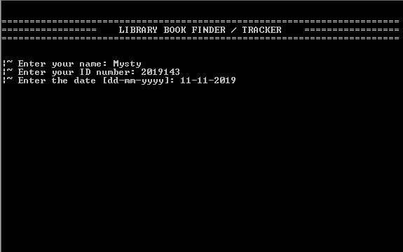
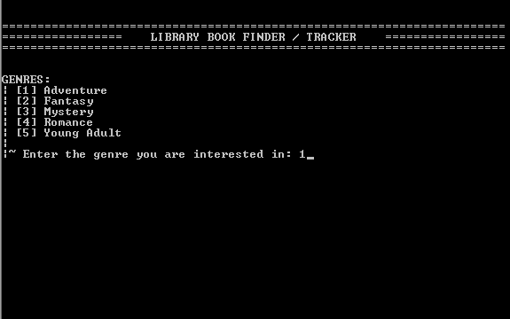
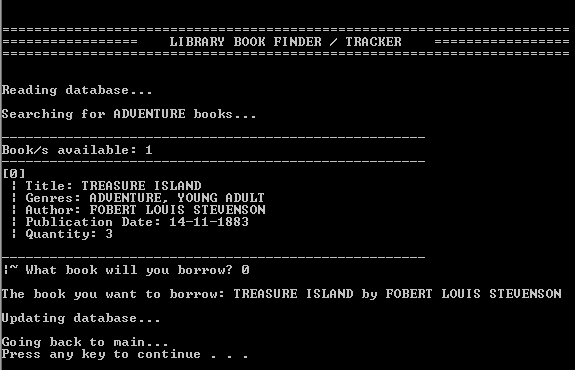

**Simple C Project**
# Library Book Finder and Tracker Console Application
This is a simple console application programmed using C that finds and tracks library books.

## Features / Functions
1. Has a database of books of different genres and the list of borrowers ("books.txt").
2. Asks for the student's information such as name, ID number, and date [dd-mm-yyyy]
3. Asks what genre the user is looking for and post a list of the book names, authors, and publication date, and inventory quantity for each of the books in the genre entered.
4. Asks which book from the search results the user will borrow.
5. If the specified book has no more available copies, the program will say so and return the student to the genre menu.
6. Create/Update a file with the borrowed book's information, student's information, and the date ("borrowers.txt").
7. Update the inventory quantity of the book borrowed ("books.txt").

## Snapshots
### Main Screen

### Genre Screen

### Search Results

